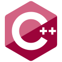

<!-- Basic Introduction -->

### About

Hello 👋 I'm bytezera04

<!-- Profile Stats -->

<!-- Languages and Tools -->

### Languages and Tools

- C Programming
- C++ Programming
- C# Programming
- Python Programming
- Databases
- Networking / Sockets

<link rel = "css/styles.css", type = "text/css", href = "styles.css">

  
  
  
  
  
  
  
  
  

